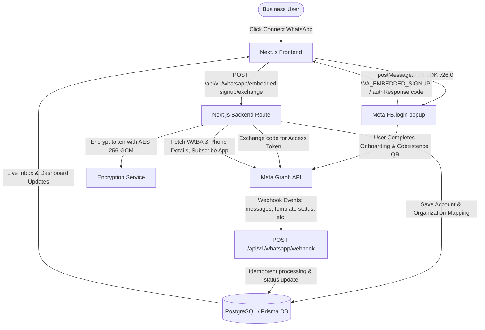

# Implementation Plan - Production-Ready WhatsApp Business Platform

Build a multi-tenant SaaS WhatsApp Business platform powered by Meta WhatsApp Cloud API and Meta Embedded Signup supporting WhatsApp Business App Coexistence (`whatsapp_business_app_onboarding`).

## User Review Required

> [!IMPORTANT]
> **Meta Public Configuration to be embedded in frontend**:
> - `META_APP_ID`: `3457567954401110`
> - `META_EMBEDDED_SIGNUP_CONFIG_ID`: `1084755870646567`
> - `META_GRAPH_API_VERSION`: `v26.0` (configurable via env)
> - `WHATSAPP_WEBHOOK_URL`: `https://aiwh.infiplus.in/api/v1/whatsapp/webhook`
> - `APP_URL`: `https://aiwh.infiplus.in`
> - Embedded Signup Feature: `whatsapp_business_app_onboarding` (Coexistence flow)

> [!WARNING]
> **Server-Only Secrets**:
> All sensitive tokens (`META_APP_SECRET`, `META_SYSTEM_USER_TOKEN`, `META_WEBHOOK_VERIFY_TOKEN`, `ENCRYPTION_KEY`, `DATABASE_URL`) will strictly remain on the server and will never be exposed to the client. Customer access tokens returned from OAuth code exchange will be encrypted at rest using AES-256-GCM.

---

## Architecture & Data Flow

---

## Database Schema (Prisma)

1. **`User`**: Multi-tenant users with secure hashed credentials.
2. **`Organization`**: Tenant boundary for accounts, templates, campaigns, and contacts.
3. **`OrganizationMember`**: Role-based access control (`OWNER`, `ADMIN`, `MEMBER`).
4. **`WhatsAppConnection`**:
   - `id`, `organizationId`, `wabaId`, `phoneNumberId`, `displayPhoneNumber`, `verifiedName`, `qualityRating`, `codeVerificationStatus`, `encryptedAccessToken`, `status` (`ACTIVE`, `PENDING_REVIEW`, `DISCONNECTED`, `COEXISTENCE_ACTIVE`), `coexistenceStatus`, `embeddedSignupCompletedAt`.
5. **`MessageTemplate`**:
   - `id`, `organizationId`, `whatsappConnectionId`, `metaTemplateId`, `name`, `category`, `language`, `status` (`DRAFT`, `PENDING`, `APPROVED`, `REJECTED`, `PAUSED`, `DISABLED`), `headerType`, `headerContent`, `body`, `footer`, `buttonsJson`, `componentsJson`, `rejectionReason`, `qualityRating`.
6. **`Contact`**:
   - `id`, `organizationId`, `phone`, `name`, `email`, `tags`, `customFields`, `optedIn` (boolean), `optedInAt`.
7. **`Campaign`**:
   - `id`, `organizationId`, `whatsappConnectionId`, `templateId`, `name`, `status` (`DRAFT`, `SCHEDULED`, `RUNNING`, `COMPLETED`, `PARTIALLY_FAILED`, `FAILED`, `CANCELLED`), `totalRecipients`, `sentCount`, `deliveredCount`, `readCount`, `failedCount`, `scheduledAt`, `startedAt`, `completedAt`.
8. **`CampaignRecipient`**:
   - `id`, `campaignId`, `contactId`, `phone`, `variablesJson`, `status` (`QUEUED`, `SENT`, `DELIVERED`, `READ`, `FAILED`), `metaMessageId`, `errorMessage`, `sentAt`, `deliveredAt`, `readAt`, `failedAt`.
9. **`Message`**:
   - `id`, `organizationId`, `whatsappConnectionId`, `contactId`, `campaignId`, `metaMessageId`, `direction` (`INBOUND`, `OUTBOUND`), `type` (`TEXT`, `TEMPLATE`, `IMAGE`, `DOCUMENT`, `INTERACTIVE`), `body`, `payloadJson`, `status` (`QUEUED`, `SENT`, `DELIVERED`, `READ`, `FAILED`), `errorCode`, `errorMessage`, `sentAt`, `deliveredAt`, `readAt`, `failedAt`.
10. **`WhatsAppWebhookEvent`**:
    - `id`, `eventType`, `wabaId`, `phoneNumberId`, `metaMessageId`, `payloadJson`, `processed`, `createdAt`.
11. **`AuditLog`**:
    - `id`, `organizationId`, `userId`, `action`, `resourceType`, `resourceId`, `metadataJson`, `ipAddress`, `createdAt`.

---

## Proposed Changes

### 1. Project Initialization & Tooling
- Initialize Next.js 14/15 App Router project with TypeScript, Tailwind CSS, PostCSS.
- Install dependencies: `@prisma/client`, `prisma`, `bcryptjs`, `jsonwebtoken`, `lucide-react`, `papaparse`, `clsx`, `tailwind-merge`.
- Set up Prisma with PostgreSQL provider.
- Configure `.env.example` and ensure `.env` is in `.gitignore`.

### 2. Core Security & Backend Services
- `services/encryption.ts`: AES-256-GCM encryption and decryption with authentication tag and initialization vector.
- `services/meta.ts`: Meta Graph API client with support for `v26.0`, authorization header management, custom timeout, backoff retry logic, and error sanitization.
- `services/whatsapp.ts`: Core WhatsApp Cloud API operations (exchange OAuth code, fetch WABA & phone details, subscribe app to WABA, register phone, fetch business profile & coexistence state).
- `services/templates.ts`: Build Meta template payload components, submit template to Meta, sync template status, delete template.
- `services/messaging.ts`: Template message payload generator, 24-hour customer service window checker, session message sender, E.164 phone validation.
- `services/campaigns.ts`: Batch dispatcher with rate limiter, variable mapping interpolation, campaign progress tracking.
- `services/webhooks.ts`: Webhook challenge verification and idempotent event dispatcher for messages, statuses, template status updates, and Coexistence events.

### 3. API Routes (`app/api/v1/...`)
- `POST /api/v1/auth/register`, `POST /api/v1/auth/login`, `GET /api/v1/auth/me`
- `POST /api/v1/whatsapp/embedded-signup/exchange`
- `GET /api/v1/whatsapp/accounts`, `POST /api/v1/whatsapp/accounts/[id]/sync`, `DELETE /api/v1/whatsapp/accounts/[id]`
- `GET /api/v1/whatsapp/templates`, `POST /api/v1/whatsapp/templates`, `DELETE /api/v1/whatsapp/templates/[id]`, `POST /api/v1/whatsapp/templates/sync`
- `POST /api/v1/whatsapp/messages/send`
- `GET /api/v1/whatsapp/campaigns`, `POST /api/v1/whatsapp/campaigns`, `GET /api/v1/whatsapp/campaigns/[id]`, `POST /api/v1/whatsapp/campaigns/[id]/dispatch`
- `GET /api/v1/whatsapp/contacts`, `POST /api/v1/whatsapp/contacts`, `POST /api/v1/whatsapp/contacts/import-csv`
- `GET /api/v1/whatsapp/inbox`, `GET /api/v1/whatsapp/inbox/[contactId]`, `POST /api/v1/whatsapp/inbox/[contactId]/reply`
- `GET /api/v1/whatsapp/webhook`, `POST /api/v1/whatsapp/webhook`

### 4. Frontend UI Pages & Components
- Design Language: Clean HR/SaaS dashboard, purple/indigo primary (`#4F46E5` / `#6366F1`), light background (`#F8FAFC`), white cards (`#FFFFFF`), subtle borders (`#E5E7EB`), Inter font, mobile-responsive layout.
- Pages:
  - `/login`, `/register`
  - `/dashboard` (Metrics & Recent Activity)
  - `/dashboard/whatsapp` (Accounts, Coexistence status, phone details)
  - `/dashboard/whatsapp/connect` (Embedded Signup SDK + `postMessage` listener + Coexistence support)
  - `/dashboard/whatsapp/templates` & `/dashboard/whatsapp/templates/create` (Template builder & realistic WhatsApp bubble preview)
  - `/dashboard/whatsapp/messages/send` (Single message & template dispatcher)
  - `/dashboard/whatsapp/campaigns` & `/dashboard/whatsapp/campaigns/create` (CSV wizard, variable mapping, queue execution)
  - `/dashboard/whatsapp/contacts` (Contact directory, CSV import/export, opt-in filter)
  - `/dashboard/whatsapp/inbox` (Live conversation chat, 24-hr window indicator, status ticks)
  - `/dashboard/whatsapp/analytics` & `/dashboard/settings`

### 5. Documentation & Meta Setup Guide
- `README.md`: Complete setup guide covering Meta App configuration, App domains allowlist, Webhooks, Embedded Signup configuration, and local & production deployment.
- `.env.example`: Complete environment variable template with placeholders.

---

## Verification Plan

### Automated / Code Quality Verification
1. `npm run build`: Verify zero TypeScript errors and successful Next.js build.
2. Prisma Schema Validation: Verify Prisma schema generation.
3. Test utilities: Verify encryption round-trip, template payload parsing, and webhook verification.

### Manual / Browser Verification
1. Test authentication and tenant isolation.
2. Test Embedded Signup flow and fallback handling.
3. Test Template Builder with live WhatsApp preview and dynamic variables `{{1}}`, `{{2}}`.
4. Test CSV contact import and column variable mapping.
5. Test Webhook endpoints (`GET` challenge verification and `POST` event handler).
